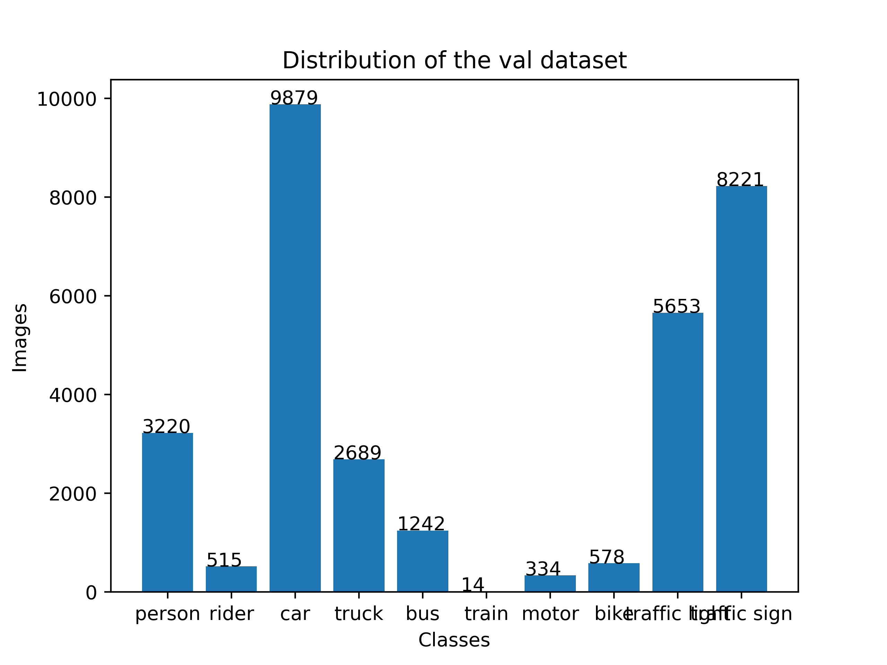
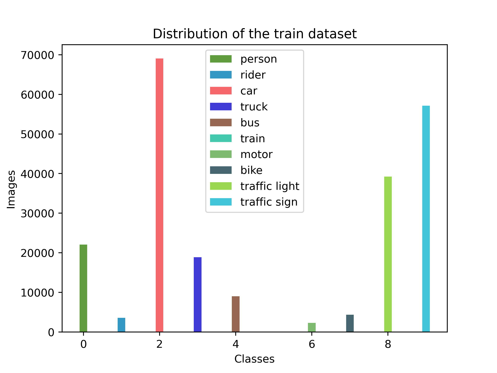
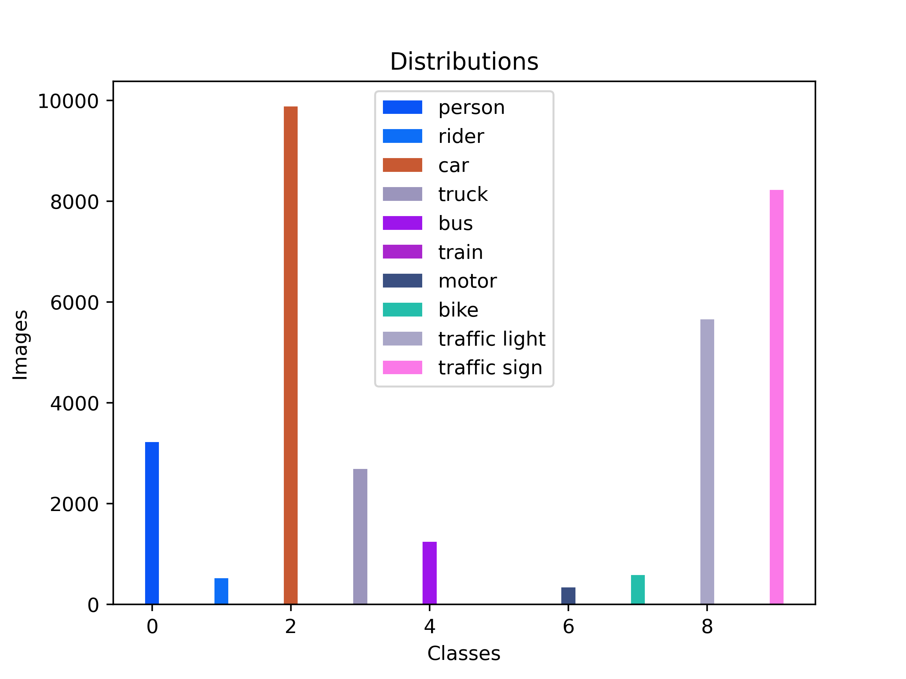

<div align="center">
<h1>Dataset class distribution</h1>
Evgenii Iurin
</div>

<br>
<div align="center">
This code was created to represent class distribution, namely how many images are used by each class.
</div>
<br>

## Introduction
Data analytics - is a powerful tool that helps to evaluate datasets and adjust the direction of your application. The distribution shows in a clear way how many images are used by each class. That serves as quick dataset evaluation. There is a code description and two plots for representation.

As a baseline, I take the Dataset BDD100K. 
<br/><br/>
## Output
As an output data algorithm returns two ```png``` files with two variants of distribution graphs. For example, there are two plots for training and validation data.

<table>
<tr>
<th>Training dataset distribution</th>
<th>Validation dataset distribution</th>
</tr>
<tr>
<td>
  
</td>

<td>
  
</td>

<tr>
<td>

</td>

<td>

</td>

</tr>
</table>

<br/><br/>

## Execution algorithm

<br/>

1. Gets a folder with prepared files (.txt and .jpg) in YOLO format at the given folder path.

<br/><br/>


2. Opens each .txt file

```
8 0.8913 0.2377 0.02427 0.1079
8 0.9171 0.2411 0.02697 0.1031
9 0.8872 0.3085 0.05395 0.0311
9 0.0390 0.0850 0.07842 0.1702
2 0.1572 0.5146 0.24419 0.3241
2 0.5529 0.4607 0.31292 0.3069
9 0.0399 0.0927 0.07989 0.1841
```
<br/><br/>

3. In YOLO format each first humber on each line represents a class, which we gave earlier. In case we have classes: ``car``, ```traffic light```, ```traffic sign```, which were represented by numbers *2*, *8*, *9* respectively

```python
classes = {'person': 0,
           'rider': 1,
           'car': 2,
           'truck': 3,
           'bus': 4,
           'train': 5,
           'motor': 6,
           'bike': 7,
           'traffic light': 8,
           'traffic sign': 9
        }
```

<br/><br/>


4. There can be several classes on one image . In order to keep the correct statistics we must calculate non-repeating classes. A sort function was written for this, that returns:
```python
[8, 9, 2]
```

<br/><br/>


5. At the next stage, the sorted array goes to the function that calculates the number of images for each class.
```python
distr_image = {'person': 0,
               'rider': 0,
               'car': 1,              // class number: 2
               'truck': 0,
               'bus': 0,
               'train': 0,
               'motor': 0,
               'bike': 0,
               'traffic light': 1,    // class number: 8
               'traffic sign': 1      // class number: 9
        }
```

<br/><br/>


6. The cycle repeats.

<br/><br/>


