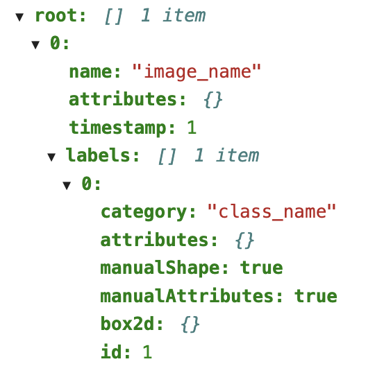

<div align="center">
<h1>Collecting class name</h1>
Evgenii Iurin
</div><br>
<div>
This code was written to collect all possible categories that are used in the dataset.
</div> <br>

## Introduction
Sometimes developers do not indicate the exact names of categories in the documentation, for example, in the official BDD100K documentation, classes such as ```pedestrian``` and ```bicycle``` are indicated, however, to define these objects, the names ```person``` and ```bicycle``` are used, respectively.

## Output
The algorithm creates a txt file containing all the classes that are used in the dataset. For example, the classes below were collected from BDD100K database.

```txt
1: traffic light
2: traffic sign
3: car
4: drivable area
5: lane
6: person
7: bus
8: truck
9: rider
10: bike
11: motor
12: train
```

## Application

From unique array traversal, an algorithm was realized to find class names only for a given JSON structure (BDD100K) or similar. Below is an annotation proposed by BDD100K. For my workload I wrote this algorithm for this dataset.

<table>
<tr>
<th>JSON entry</th>
<th>JSON structure</th>
</tr>
<tr>
<td>
  
```json
  [{ 
        "name": "image_name",
        "attributes": {},
        "timestamp": number,
        "labels": [{"category": "class_name",
                    "attributes":{},
                    "manualShape": True,
                    "manualAttributes": True,
                    "box2d": {}, 
                    "id": number}] 
  }]
```
  
</td>
<td>

</td>
</tr>
</table>

## Execution algorithm

The algorithm opens a JSON file, loops through all the elements in an array containing labels with undefined class numbers. The algorithm adds the class name to the array if this class does not appear. From this array, the algorithm generates a text file.

## Code description
Import required libraries. ```os``` allows to work with the OS system, e.g. creates and removes files. The ```json``` library allows to interact with json files. With ```tqdm``` we can trace the processing stage. 
```py
import os
import json
import tqdm
```
This block defines the path to the necessary json file. 
```py
PATH = '/nfs-home/Prepare_BDD100K_in_the_YOLO_format/JSON_Labels/train_labels/'
FILE_NAME = 'bdd100k_labels_images_train.json'
RELATIVE_PATH = PATH + FILE_NAME
categories = []
```

This function transforms json format to python readable format.   

```py
""" Load JSON file """
def load_json_file(path):
    with open(path) as json_file:
        json_object = json.load(json_file)
    return json_object
```
The function takes the class name and adds it to the categories only if that class name is not repeated.

```py
""" Sort duplicate categories """
def sort_collection(category):
    if not category in categories:
        categories.append(category)
    return
```
The main function containing the array traversal algorithm. The function extracts the category name from each image and sends it to the sort function.

```py
""" Collects all categories in each image dictionary """
def collect_categories(path):

    data = load_json_file(path)
    
    for image_dict in tqdm.tqdm(range(len(data))):
        for i in range(len(data[image_dict]['labels'])):
            sort_collection(data[image_dict]['labels'][i]['category'])
    return


def main():
    collect_categories(RELATIVE_PATH)
    print(categories)

if __name__ == '__main__':
    main()
```

This block created a .txt file that contains all the unique class names.


```py
if os.path.exists('categories.txt'):
    os.remove('categories.txt')

with open("categories.txt", "w") as f:
    for num_category in range(len(categories)):
        f.write(f'{num_category+1}: {categories[num_category]}')
        f.write("\n")
```

