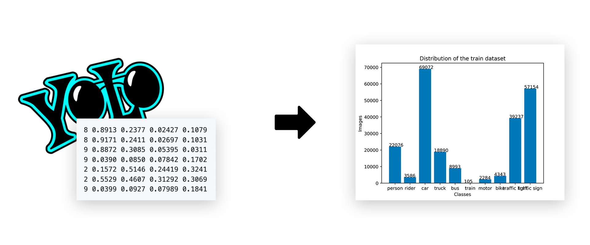
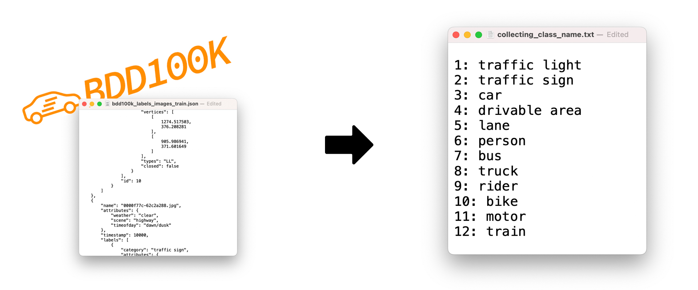

<div align="center">
<h1>Dataset preparation</h1>
Evgenii Iurin
</div>

<br/>

# Introduction

My responsibilities as an ML Engineer include preparing a database for training neural networks. I have experience with two datasets:
- BDD100K
- Waymo Dataset

<br/>
<br/>


# Cases
<br/>

## Dataset class distribution
Data analytics - is a powerful tool that helps to evaluate datasets and adjust the direction of your application. The distribution shows in a clear way how many images are used by each class. That serves as quick dataset evaluation. There is a code description and two plots for representation.


## Collecting class name
Sometimes developers do not indicate the exact names of categories in the documentation, for example, in the official BDD100K documentation, classes such as ```pedestrian``` and ```bicycle``` are indicated, however, to define these objects, the names ```person``` and ```bike``` are used, respectively.


## Waymo Dataset preparation

